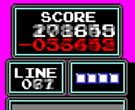
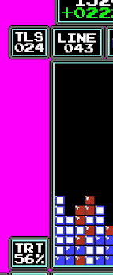

## Tetris Rate Adder

This project generates a stats overlay video file from a TreyVision match rendering. Specifically, adding a Tetris Rate box (a.k.a. `TRT`).

Example of an overlay frame:


The program works on the following assumptions about the TreyVision files:
* They are all following the **exact** same layout (meaning the line count is always found at the same location)
* The line counter is "clean" -> always increases through the game, and only jumps by 1, 2, 3, or 4.

The Tetris Rate can be computed entirely from the lines counter. In a game, the line counter can increase by 1, 2, 3, or 4, for singles, doubles, triples, and tetrises respectively. By cumulating the +4 jumps, the programs aggregates the total number of lines cleared in tetrises, and the Tetris Rate forumla is simply:
```
lines_cleared_in_tetrises / total_lines_cleared
```

In any Tetris game, the line counter is a "stable" metric on screen. That means it stays constant over many consecutive frames, since it is impossible for a player to clear lines on consecutive frames (one must account for the time a given Tetris piece takes to fall to the bottom).

While the line count is stable, when it does change, we have seen in some edited TreyVision footage that "fuzzy" frames crept their way in. The resulting blur causes incorrect reads of the new line count, which leads to an incorrect Tetris Rate computation. To work around this problem, any detected change to the line count will wait one frame before reading the value. This works thanks to the stability of the metric, as described above.

The read delay can easily be increased to 2 or 3 frames as needed, should the transition fuzziness affect multiple consecutive frames.

Example of a fuzzy frame on line clear:




## Installation

(OSX instruction)

This was only tested in python 3.7.9, so on OSX use it with `brew`:

```bash
brew update
brew install python@3.7
brew link --overwrite python@3.7
pip3 install -r requirements.txt
```

## Running:

From the chekcout folder, run:

```
python3 trt_movie.py <PATH_TO_TREYVISION_GAME_FILE>
```

Running that command generates an overlay file with 2 `TRT` boxes, that can be composited later over the game footage. The file name for the overlay is:
```
<PATH_TO_TREYVISION_GAME_FILE>.trt.mp4
```

### QA and verification

Looking at the overlay alone, it is impossible to know if the values of the `TRT` are correct, since the gameplay is not visible. Doing the compositing job manually to validate accuracy of the values is quite laborious and slow.

Additionally, even after composition, looking at the game and Tetris Rate, only partial validation can easily be done. While one can easily verify that tetrises do indeed raise the Tetris Rate, while every other type of line clears decreases it, how does one know for sure that the `TRT` value is correct?

The `TRT` value is simply all the lines cleared in tetrises divided by all the lines cleared in total (then times 100 to make it a percent). Since the total line count is already visible in the TreyVision UI in the box `LINE`, one only needs to keep track of the total number of lines cleared in tetrises. It is possible to do this by hand, but that would be slow and laborious too.

To solve both of these problems, the tool can be run in a verification mode like this:
```
python3 trt_movie.py <PATH_TO_TREYVISION_GAME_FILE> --verify
```

Instead of generating just the overlay, that command outputs the original game frames with the Tetris Rate boxes already composited into them, AND an additional data box for each player labelled `TLS` (for **T**etris **L**ine**S**). That `TLS` box cumulates the lines cleared in tetrises.

To then verify the footage, one can watch the video and verify that:
1. The tetris lines counter only increases for tetrises, and always increases by 4
2. The computed `TRT` is indeed the rounded division of `TLS` over `LINE`


When verification is done, the `TRT` overlay can then be generated by running a second command:
```
python3 trt_movie.py <PATH_TO_TREYVISION_GAME_FILE> --from-json-frames
```

Running this second command is much faster, because it uses the frame data previously computed by the first command. It does not have to read the source file and ocr again 👍

Sample verification mode:




## Aknowledgment

Reading the line count from the TreyVision footage is done using the file `digitocr.py` from the excellent [NESTrisOCR](https://github.com/alex-ong/NESTrisOCR) project by [Alex Ong](https://github.com/alex-ong).


## Related Project

Take a look at [NESTrisStatsUI](https://github.com/timotheeg/NESTrisStatsUI) for a project computing Tetris stats from a live tetris games.


